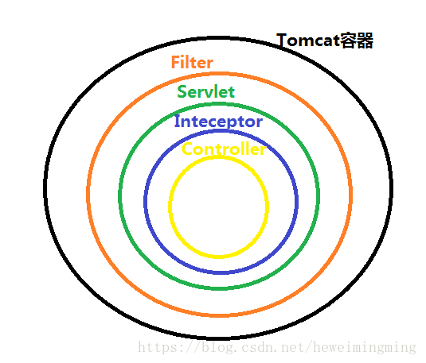

#




## Filter
> 过滤器

Filter属于Servlet容器规范，适用于Web程序

```java
// 定义Filter
package com.project.filter;

public class FilterName implements Filter {
  @Override
  public void doFilter(final ServletRequest req, final ServletResponse res, FilterChain chain) throw IOException, ServletException {
    // do something...
  }
}

// 入口文件：使用
package com.project;

public class MainAppliction {
  @Bean
  public FilterRegistrationBean filter () {
    final FilterRegistrationBean bean = new FilterRegistrationBean();
    bean.setFilter(new FilterName());
    bean.addUrlPatterns("/api/**");
  
    return bean;
  } 
}
```

## Interceptor
> 拦截器

Interceptor属于Spring容器规范，适用于Web、Application、Swing程序

```java
// 定义
package com.project.interceptor;

public class InterceptorName {
  @Override
  public boolean preHandle(final HttpServletRequest req, final HttpServerletResponse res, Object handle) throw Exception {
    // do something... return false or true;
    return true;
  }
  
  @Override
  public void postHandle(final HttpServletRequest req, final HttpServletResponse res, Object handler, ModelAndView modelAndView) throws Exception {
    System.out.println("=============postHandle============");
  }
  
  @Override
  public void afterCompletion(final HttpServletRequest req, final HttpServletResponse res, Object handler, Exception ex) throws Exception {
    System.out.println("=============afterCompletion============");
  }
}

// 入口
package com.project;

public class MainApplication {
  @Bean
  public WebMvcConfigurer interceptor (InterceptorRegistry registry){
    registry.addInterceptor(new InterceptorName())
                        .addPathPatterns("/api/**")
                        .excludePathPatterns("/users/login");
  }
}
```

### Servelet

`Java Servelet`的简写，`Servelet`是`Server Applet`的合成词，意思为：小服务程序或服务连接器，是用Java编写的服务端程序，主要用于依据客户端请求生成交互式的动态Web内容。  
通常`Servelet`是指Java语言实现的一个接口或者实现了这个接口的类

#### JSP
`Java Server Pages`，专门用于表现层开发的镶嵌型动态脚本语言，类似于ASP、PHP